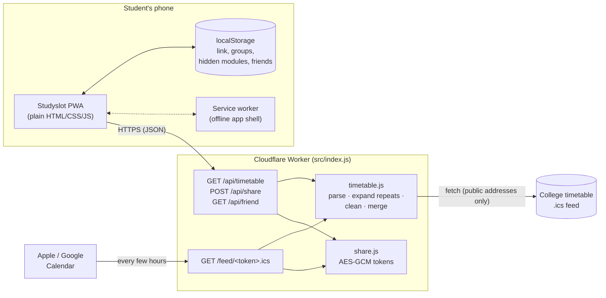

# Studyslot

[](https://github.com/ShaneD288/StudySlot/actions/workflows/ci.yml)

Your college timetable, cleaned up: paste your calendar link, see what's on, where and when.

**Live:** [studyslot.ie](https://studyslot.ie) (beta)

<!--
  DRAFT NOTES: Shane to rewrite this intro in his own words. Points to cover:
-->

- Free web app (PWA) for Irish college students, starting with TU Dublin
- Problem: college timetables are cluttered with module codes, group labels, room capacities and every lab group's slot
- Students paste the calendar link their college already gives them (`.ics` / `webcal://`)
- Studyslot shows a clean today/week view, only their own lab groups, and free time shared with friends
- No accounts, timetables never stored on the server, works offline once loaded

## Screenshots

<!--
  TODO(Shane): add 2-3 phone screenshots or a short GIF (Today, Week, Friends), e.g.
  docs/screenshots/today.png, and reference them here:
  
-->

_Screenshots coming soon._

## Features

- **Works with any college** that offers a calendar link (iCal / webcal), including TU Dublin's Scientia timetables, Google Calendar and Outlook.
- **Today view:** "Now" (highlighted, with time left) or "Next", then the day's classes with free gaps between them.
- **Week view:** day strip with class counts. Weekends appear only when there are classes.
- **Week numbers:** "Week 4 of 12". Terms are detected from when classes run, and reading weeks show as "no classes".
- **Groups:** when a timetable lists Lab A and Lab B at the same time, students pick their group once.
- **Hide modules** they don't take.
- **Add to your calendar:** a cleaned calendar feed for Apple or Google Calendar, with the chosen groups, hidden modules and a 10-minute alert before each class.
- **Friends:** share a private link or QR code, then see **free time together** (9:00–18:00) and **classes you share**.
- **Installable and offline:** add to the Home Screen; the last timetable stays available without a connection.
- **One-screen setup:** paste your timetable link and go. No account, no questions.

## Architecture



1. The app sends the student's calendar link to the Worker (`/api/timetable`).
2. The Worker fetches the `.ics` file, expands repeating classes in the student's time zone, applies moved and cancelled classes, cleans titles and rooms, and merges back-to-back slots.
3. The cleaned classes go back as JSON and are saved on the phone. Nothing is kept on the server.
4. For calendar feeds and friend links, the Worker encrypts the student's settings into a token. Whoever holds the link gets the cleaned timetable, but can't read the timetable link inside.

| Path                         | Purpose                                                                                  |
| ---------------------------- | ---------------------------------------------------------------------------------------- |
| `src/index.js`               | Worker: routing, link checks, rate limits, timetable API, friend API, calendar feed      |
| `src/timetable.js`           | Expands repeats, applies overrides, cleans titles and rooms, merges back-to-back classes |
| `src/ical.js`, `src/time.js` | iCalendar parsing and time-zone conversion (no libraries)                                |
| `src/share.js`               | Encrypted sharing tokens (AES-256-GCM, HKDF) and friend ids (HMAC)                       |
| `public/app.js`              | The app's UI                                                                             |
| `public/lib/`                | Pure app logic (dates, week numbers, filtering, free time, friend links), unit-tested    |
| `public/sw.js`               | Service worker for offline use                                                           |
| `test/`                      | Vitest tests and a synthetic timetable fixture                                           |

## Design decisions

<!--
  DRAFT NOTES: Shane to rewrite this section in his own words.
-->

**Why no accounts**

- Nothing to sign up for, so students can try it in seconds
- No passwords or personal data to protect, no database to breach
- Settings live in `localStorage`; "Remove my timetable" clears everything
- Trade-off: settings don't sync between devices

**Why a Cloudflare Worker**

- Browsers can't fetch most college `.ics` files directly (CORS), so a small server is needed
- A Worker is stateless, which matches "nothing stored"
- Free plan covers expected student traffic; runs close to users; no servers to patch
- Built-in rate limiting and `global_fetch_strictly_public` help with abuse
- Trade-off: platform-specific (bindings, `wrangler`), CPU-time limits per request

**Why plain JavaScript**

- No framework or build step: the code in `public/` is exactly what runs
- Small download (no framework runtime), fast on cheap phones
- Easy to explain line by line
- Pure logic split into ES modules in `public/lib/` so it can be unit-tested
- Trade-off: manual DOM updates (`h()` helper) instead of components

**How abuse is prevented**

- Rate limits: 20 timetable lookups a minute per visitor, 10 feed requests a minute per feed link
- Link checks: no passwords, raw IP addresses or custom ports; only `http(s)`/`webcal`
- Only public addresses fetched (`global_fetch_strictly_public`), 12 s timeout, 6 MB limit
- Strict Content-Security-Policy and security headers (`public/_headers`)
- No third-party scripts, fonts or analytics

**Friend and feed links (encrypted tokens)**

- Problem: links used to be the timetable link in base64, so anyone could decode it
- Options: (A) encrypt the token with a server key; (B) store tokens in Cloudflare KV so they can be revoked
- Chose A: keeps "nothing stored on the server"
- AES-256-GCM: can't be read, and any change is detected (authentication tag)
- Friends receive classes, never the timetable link; an HMAC id spots duplicates
- Revoking ("Reset my link"): KV (`LINK_RESETS`) keeps, only for students who reset, their HMAC id → a random
  generation. Friend tokens carry their generation and older ones are refused. No timetable data is stored
- Calendar-feed tokens are marked calendar-only (`p: "c"`): a reset doesn't break the student's own calendar, and a
  calendar token can't be used as a friend link
- Old base64 links accepted until 1 February 2027, with a "please share again" message

## Privacy

- **No accounts, no cookies, no analytics.** Local storage is used only for features the student asks for (exempt from consent under S.I. 336/2011).
- **Timetables never stored on the server.** They're fetched, cleaned and returned in memory. The only server-side
  state is the reset record (an HMAC id and a random value) for students who reset their friend link.
- **Private sharing links:** encrypted with AES-256-GCM (key derived from the `SHARE_KEY` secret). Friends get a friend's classes, never their timetable link. See `src/share.js`.
- **No third-party requests:** the font (`public/fonts`, SIL OFL) and QR library (`public/vendor`, MIT) are self-hosted.
- **Privacy Policy** (`/privacy`) and **Terms of Use** (`/terms`) are written for Irish and EU law (GDPR, ePrivacy). They are drafts, not legal advice.

## Testing

```
npm test             # Vitest: unit, Worker and app smoke tests
npm run lint         # ESLint
npm run format:check # Prettier
```

- **Parsing and time zones:** iCalendar unfolding, escaping, TZIDs (including Outlook's Windows names), Irish daylight-saving changes
- **Timetable cleanup:** repeat rules, moved and cancelled classes, reading weeks, lab groups, title and room cleanup, back-to-back merge
- **Worker:** link checks, error messages, size limits, rate limits, encrypted tokens and tampering, calendar feeds, using a mocked `fetch`
- **App logic:** week numbers, free time together, friend filtering, friend-link parsing
- **Smoke test:** boots the real app in happy-dom, including keyboard navigation
- **Fixture:** `test/fixtures/scientia-sample.ics`, a synthetic TU Dublin-style timetable (see its README)

CI runs all of this on every push and pull request (`.github/workflows/ci.yml`).

## Run and deploy

```
npm install
cp .dev.vars.example .dev.vars   # then put a random key in SHARE_KEY
npm run dev                      # http://localhost:8787
```

Deploys happen from GitHub Actions: after CI passes on `main`, `.github/workflows/deploy.yml` runs `npm run deploy` (`wrangler deploy`). It needs the `CLOUDFLARE_API_TOKEN` and `CLOUDFLARE_ACCOUNT_ID` repository secrets, and the `SHARE_KEY` Worker secret, set once:

```
npx wrangler secret put SHARE_KEY
```

To release, bump `version` in `package.json` and `APP_VERSION` in `public/app.js`, and update the service worker's `VERSION` to match (a test checks all three), then add an entry to `CHANGELOG.md`.

See [docs/launch-checklist.md](docs/launch-checklist.md) for the steps before a public launch.

## Licence

[MIT](LICENSE). The font and QR code library keep their own licences (`public/fonts/OFL.txt`, `public/vendor/qrcode-generator-LICENSE.txt`).
